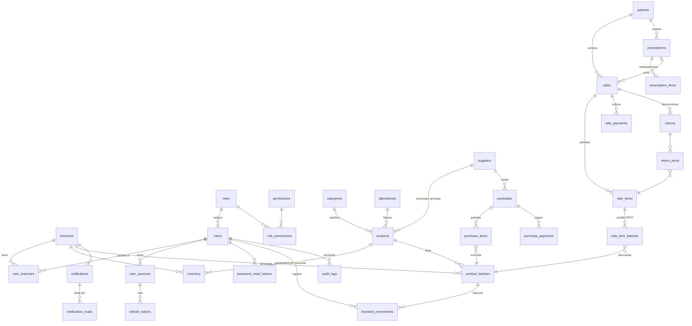

# Base de datos

PostgreSQL 16 con Prisma ORM. El esquema completo está en
[`apps/api/prisma/schema.prisma`](../apps/api/prisma/schema.prisma) y las migraciones en
[`apps/api/prisma/migrations`](../apps/api/prisma/migrations).

## Modelo entidad-relación



## Tablas

| Grupo | Tabla | Propósito |
|---|---|---|
| Organización | `branches` | Sucursales. Hoy sólo existe "Matriz"; todo dato operativo se liga a una sucursal. |
| | `settings` | Configuración clave/valor (JSON): datos de la farmacia, fiscales, moneda, impuestos, alertas. |
| Seguridad | `users` | Usuarios (correo único en minúsculas, hash Argon2id, bloqueo por intentos, *soft delete*). |
| | `roles`, `permissions`, `role_permissions` | Roles con permisos granulares (`inventory.adjust`, ...). |
| | `user_branches` | Sucursales a las que tiene acceso cada usuario. |
| | `user_sessions`, `refresh_tokens` | Sesiones revocables y refresh tokens rotativos (sólo hash). |
| | `password_reset_tokens` | Recuperación de contraseña de un solo uso (sólo hash). |
| Catálogo | `categories`, `laboratories` | Catálogos de clasificación. |
| | `products` | Medicamentos: nombres, principio activo, presentación, precios, tasa de IVA, receta. |
| Inventario | `inventory` | Stock mínimo/máximo y ubicación **por producto y sucursal**. |
| | `product_batches` | **Lotes**: cantidad, caducidad, costo. Es la única fuente de verdad del stock. |
| | `inventory_movements` | Bitácora **inmutable** de toda entrada/salida (antes, cambio, después, usuario, motivo). |
| Compras | `suppliers` | Proveedores (RFC, crédito, condiciones). |
| | `purchases`, `purchase_items` | Compras con lote y caducidad por partida. |
| | `purchase_payments` | Pagos a proveedor (crédito y pagos parciales). |
| Ventas | `sales`, `sale_items` | Ventas con folio, impuestos y costo (para calcular la utilidad). |
| | `sale_item_batches` | Qué lotes surtieron cada partida (FEFO). |
| | `sale_payments` | Cobros por método (efectivo, tarjeta, transferencia, otro). |
| | `returns`, `return_items` | Devoluciones con destino del producto: reingreso, cuarentena o desecho. |
| Pacientes | `patients` | Datos personales (acceso restringido y auditado). |
| | `prescriptions`, `prescription_items` | Registro administrativo de recetas. |
| Sistema | `notifications`, `notification_reads` | Alertas por sucursal y estado de lectura por usuario. |
| | `audit_logs` | Auditoría **inmutable**: usuario, acción, IP, agente y metadatos. |

## Reglas garantizadas por la base de datos

Además de las validaciones de la API, PostgreSQL rechaza estados inválidos
(migración `integrity_constraints`):

| Regla de negocio | Mecanismo |
|---|---|
| Stock nunca negativo | `CHECK (quantity >= 0)` en `product_batches` |
| Movimientos cuadrados | `CHECK (quantity_after = quantity_before + quantity_change)` y `quantity_after >= 0` |
| Historial inmutable | Triggers `BEFORE UPDATE OR DELETE` y `BEFORE TRUNCATE` en `inventory_movements` y `audit_logs` |
| Lotes independientes | `UNIQUE (product_id, branch_id, lot_number)` |
| Cantidades y montos válidos | `CHECK` de positividad en partidas, pagos y precios; `tax_rate` entre 0 y 1 |
| Correo único sin ambigüedad | `UNIQUE (email)` + `CHECK (email = lower(email))` |
| Búsqueda rápida de productos | Índice GIN trigram sobre nombre comercial, genérico y principio activo |

## Decisiones de diseño

- **Stock derivado, no duplicado.** El stock de un producto es `SUM(product_batches.quantity)`
  por sucursal. No existe un contador global que pueda desincronizarse. La tabla `inventory`
  sólo guarda parámetros: mínimo, máximo y ubicación.
- **FEFO.** El índice `(branch_id, product_id, status, expires_at)` permite elegir en cada venta
  el lote vendible que caduca primero. La venta bloquea esas filas (`FOR UPDATE`).
- **Caducidad calculada.** "Caducado / crítico / próximo / normal" se calcula a partir de
  `expires_at` y los días configurados en `settings`. No se guarda, así nunca queda desactualizado.
- **Soft delete** (`deleted_at`) en usuarios, productos, categorías, laboratorios, proveedores,
  pacientes y recetas. Los registros históricos (ventas, movimientos) siguen apuntando a ellos.
- **Folios legibles** (`number`, autoincremental) en compras, ventas, devoluciones y recetas,
  además del UUID interno.
- **Dinero en `DECIMAL(12,2)`** y costos unitarios en `DECIMAL(12,4)`, nunca `float`.

## Comandos

```bash
npm run db:migrate   # Crear/aplicar migraciones en desarrollo
npm run db:deploy    # Aplicar migraciones pendientes (producción)
npm run db:seed      # Roles, permisos, sucursal, configuración y propietario
```
